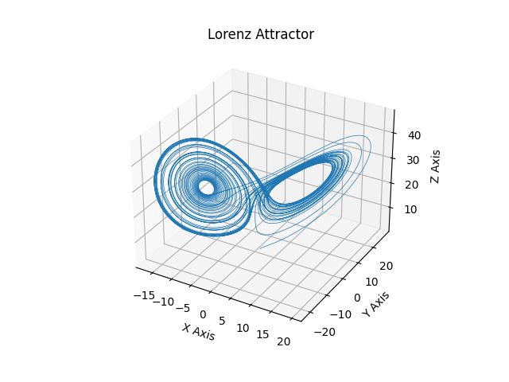

# Lorenz Attractor

The Lorenz attractor is a mathematical model that represents a simplified version of fluid dynamics and atmospheric convection. It was introduced by Edward Lorenz in 1963 while he was studying weather patterns. The Lorenz attractor is a set of three nonlinear differential equations that describe the behavior of a system over time.

The Lorenz attractor helps us visualize the chaotic behavior of certain systems, such as the weather. It is often depicted as a butterfly-shaped plot in 3D space, with two "wings" representing two stable states that the system can switch between. The system's trajectory spirals around these wings without ever settling down to a fixed point or repeating its path.

The main takeaway from the Lorenz attractor is that it demonstrates the sensitive dependence on initial conditions, often referred to as the "butterfly effect." This concept highlights that small changes in the initial conditions of a system can lead to drastically different outcomes over time. In the context of weather prediction, this means that even tiny errors in the initial data can make long-term forecasts unreliable.

### Try it
If you want to try it out and play around with the different initial conditions to see the effects, use the following steps:

- Clone the Repo
- "cd" into the directory
- Activate the virtual environment:
  - "source venv/bin/activate"
- Let it run
